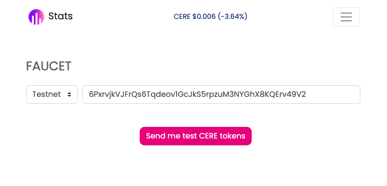

# 🔑 Setup

## Install DDC CLI

DDC CLI provides a flexible set of commands for developers to help setting up a DDC account, upload/download files and more.

### System requirements

* NodeJS >= 18.0.0

### Installation

Global installation:

```bash
npm install -g @cere-ddc-sdk/cli
```

As a project dependency

```bash
npm install --save-dev @cere-ddc-sdk/cli
```

Running with [NPX](https://www.npmjs.com/package/npx) will auto-install the package

```bash
npx @cere-ddc-sdk/cli [command] [options]
```

## Create an account

If you don’t have a account (wallet) yet, you can use DDC CLI to generate a random one for you:

```shell
npx @cere-ddc-sdk/cli account --random
```

Output example:

```
New account
  Type: sr25519
  Mnemonic: gospel fee escape timber toilet crouch artist catalog salt icon bulb ivory
  Address: 6PxrvjkVJFrQs6Tqdeov1GcJkS5rpzuM3NYGhX8KQErv49V2
  Public key: 0xd0020aa2d6022ced67d215acb2734cd267284cd4bc78684f659e9f040685fc2b
```


Please write down your secret phrase and keep it in a safe place. The secret phrase can be used to restore your keys (wallet). Put it in a safe place so you do not lose your data.


Or you can get an account (wallet) information from the existing secret phrase (mnemonic):

```shell
npx @cere-ddc-sdk/cli account --signer 'gospel fee escape timber toilet crouch artist catalog salt icon bulb ivory'
```

Output example:

```
Account information
  Network: testnet
  Type: sr25519
  Address: 6TWQvyhAjqjWgRU6gCYhfmf3c2DRq2m7FMLgz2FGniiqLSZu
  Public key: 0xb0c87213073be0d9820647266c3f16ea676a6c91a1a149dc36feeb3c56df4469
  Balance: 0
  Deposit: 0
```

### Transfer tokens

Use [Cere Testnet faucet](https://stats.cere.network/faucet) to send tokens to your account (wallet)

<figure><figcaption></figcaption></figure>


The faucet will  transfer 100 CERE tokens to your account (wallet)


Check the account balance again to confirm the transfer

```bash
npx @cere-ddc-sdk/cli account --signer 'gospel fee escape timber toilet crouch artist catalog salt icon bulb ivory'
```

The output should be:

```
Account information
  Network: testnet
  Type: sr25519
  Address: 6TWQvyhAjqjWgRU6gCYhfmf3c2DRq2m7FMLgz2FGniiqLSZu
  Public key: 0xb0c87213073be0d9820647266c3f16ea676a6c91a1a149dc36feeb3c56df4469
  Balance: 100
  Deposit: 0
```

### Make deposit

Use the following command to deposit a portion of the account balance:

```bash
npx @cere-ddc-sdk/cli deposit 50 --signer 'gospel fee escape timber toilet crouch artist catalog salt icon bulb ivory'
```

Output example:

```
Deposit completed
  Network: testnet
  Address: 6TWQvyhAjqjWgRU6gCYhfmf3c2DRq2m7FMLgz2FGniiqLSZu
  Amount: 50
  Total deposit: 50
```


Your account (wallet) is ready for experiments with DDC!

