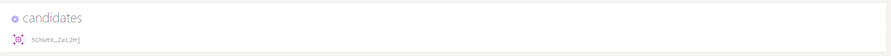
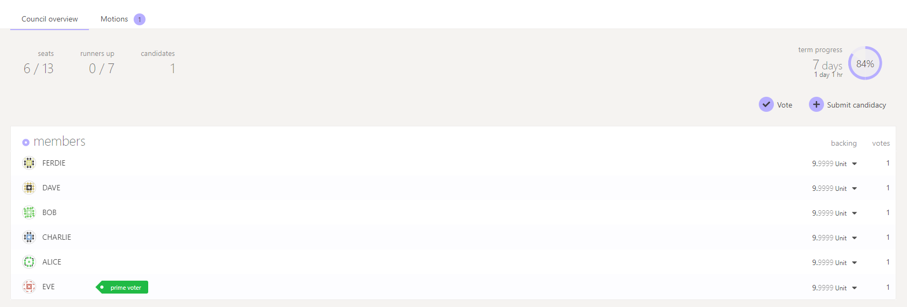

# Council

### Council

Cere Network's Council serves as an elected body of network participants that are intended to represent the passive stakeholders of the greater Cere Network. The Council serves two primary tasks in the Cere Network governance process: proposing referenda and vetoing malicious or dangerous referenda.

### Submitting Candidacy

In order to join the Cere Network Council, the submission request requires a small amount of Cere Tokens to be bonded. The bond will be forfeited if the candidacy submission does not win or becomes a runner-up. If you are elected to the Council, the bond will be kept.

If you intend to run for a spot on the Council it's a good idea to announce your intentions in one or more of Cere's public forums (Telegram, Twitter, etc.) prior to your submission so that your supporters will know when to vote for you.

### Submission

Navigate to the Cere Network Council tab [here](https://explorer.cere.network/#/council). Click on the "Submit candidacy" button.

After completing the transaction, you will see your account appear in the "Candidates" row.

Once your submission is in, we recommend kicking off the voting process by giving yourself the first vote. Click on the "Vote" button to initiate the transaction.

If you were selected to join the council during the voting period you will have won the council election and your account will now display under the "Members" section.

Congratulations on being elected! Now you are able to participate by making motions or voting on proposals.
