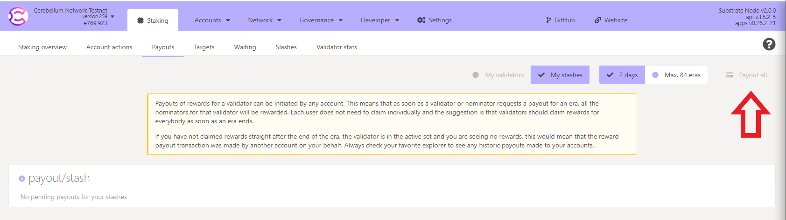

# Staking/Slashing

### Staking

Cere Network uses NPoS (Nominated Proof-of-Stake) as its mechanism for selecting the validator set.&#x20;

Nominators may back up to 16 validators as trusted validator candidates.

Validators do most of the heavy lifting: they produce new block candidates in BABE, vote, and come to consensus in GRANDPA. Nominators, on the other hand, do not need to do anything once they have bonded their CERE. The experience of the nominator is similar to "set it and forget it," while the validator will be doing active service for the network by performing the critical operations.

### Slashing

Slashing is a mechanism built into proof of stake blockchain protocols to discourage validator misbehavior. Slashing is designed to incentivize node security, availability, and network participation.

Slashing will happen if a validator misbehaves (e.g. goes offline, attacks the network, or runs modified software) in the network. They and their nominators will get slashed by losing a percentage of their bonded/staked CERE. Any slashed CERE will be added to the Treasury.

Once a validator gets slashed, it goes into the state as an "unapplied slash". While unapplied, a governance proposal can be made to reverse it during this period. After the grace period, the slashes are applied.

The following levels of offense are defined (for specific slash amounts see the equations in the section below):

* Level 1: Isolated unresponsiveness. i.e. being offline for an entire epoch. No slashing, only chilling.
* Level 2: concurrent unresponsiveness or double-signing. Slashes a very small amount of the stake and chills.
* Level 3: misconducts unlikely to be accidental, but which do not harm the network's security to any large extent. Examples include concurrent equivocation or isolated cases of unjustified voting in GRANDPA. Slashes a moderately small amount of the stake and chills.
* Level 4: misconduct that poses serious security or monetary risk to the system, or mass collusion. Slashes all or most of the stake behind the validator and chills.

#### GRANDPA Equivocation

A validator signs two or more votes in the same round on different chains.

#### BABE Equivocation

A validator produces two or more blocks on the Relay Chain in the same time slot.

#### Chilling

Chilling is the act of removing a validator from the active validator set, also disqualifying them from the set of electable candidates in the next NPoS cycle.

### Claiming rewards

In order to be paid your staking rewards, someone must claim them for each validator that you nominate. Staking rewards are kept available for 84 eras, which is approximately 84 days. For more information on why this below.

### Payouts

Anyone can trigger a payout for any validator, as long as they are willing to pay the transaction fee. Someone must submit a transaction with a validator ID and an era index. Cere Network will automatically calculate that validator's reward, find the top 128 nominators for that era, and distribute the rewards pro-rata.

If a payout is possible, you may trigger a payout by going to the [payout dashboard ](https://explorer.cere.network/#/staking/payout)and clicking the `payout-all` button and signing the transaction.

