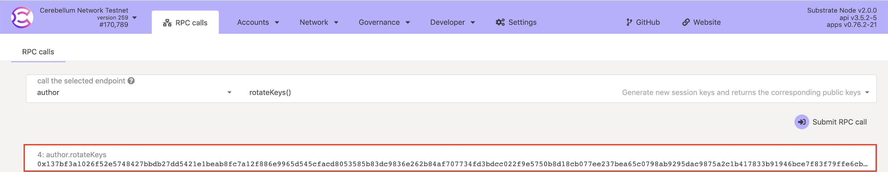
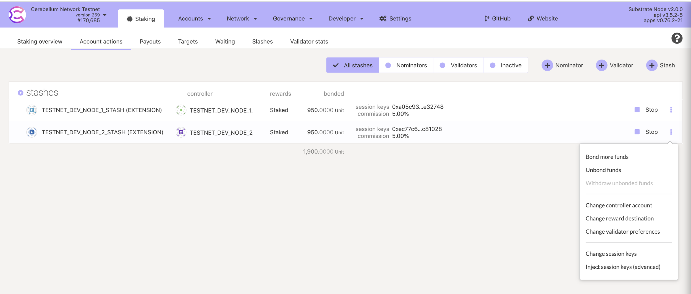
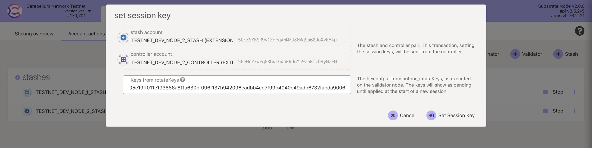

# Update a Validator Node

This manual is supposed to be used for upgrading your Validator Node or machine and keeping your Validator online. The process will take several hours, so make sure you understand the instructions first and plan accordingly.

## Key components

Validator A - current validator

Validator B - new validator

Machine A - a machine where Validator A is hosting

Machine B - a machine where Validator B is hosting

## Steps

1\. Launch Validator B on Machine B by following the [instructions (1-6)](https://cere-network.gitbook.io/cere-network/node/install-and-update/start-a-node) and wait until it is synced.

2\. Connect with the [Cere Explorer](https://explorer.cere.network/) to Validator B.

3\. Select Tab `Developer` -> `RPC calls`.

4\. Select `author` -> `rotateKeys`.

5\. Press `Submit RPC call`.

6\. Double click on it to save the rotation key to the clipboard.

7\. Select Tab `Network` -> `Staking` -> `Account actions`.

8\. Select `Validators`.

9\. Select Validator with Controller/Stash accounts as in Validator A, press 3 dots -> `Change session keys`.

10\. Insert previously generated rotation key.

11\. Press `Set session key`.

12\. **!Important** Wait until the message `Pre-sealed block for proposal at` **appears** in Validator B and **disappears** in Validator A logs. You can do it by running the following command in the Validator Nodes root directory:\
\*\*\*\*`docker-compose logs -f --tail=1000 | grep "Pre-sealed block for proposal at"`

13\. Now you can safely stop Validator A using command: `docker-compose stop add_validator_node_custom` in order to update either the Validator A itself or Machine A.

14\. Repeat steps 1-12 for Validator A on Machine A.

15\. Now you can stop Validator B.

16\. You’re done, the Validator A has been updated successfully.
